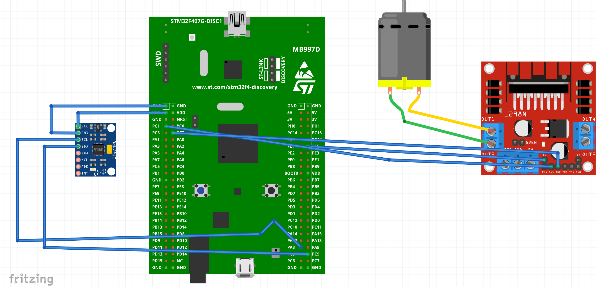

# Plant Watering System with the STM32F429 MCU

## Overview
This project automates the watering of plants using an STM32F429 Development Kit, PWM controlled DC motor, and an I2C moisture sensor.
The skills I wanted to work on in this project were learning STM microctrollers, working with PWM signals, I2C communication, and power supplies.

## Features
- Soil moisture monitoring 
- Automated watering using a step-controlled motor and a control system to maintain moisture levels
- Configurable low-power mode and RTC-interrupt generation

## Components
- STM32F429 Development Kit (https://www.digikey.com/en/products/detail/stmicroelectronics/STM32F429I-DISC1/5731713) 
- Capacitive soil moisture sensors -- https://www.tindie.com/products/miceuz/i2c-soil-moisture-sensor/, documentation: https://github.com/Miceuz/i2c-moisture-sensor/blob/master/README.md, also purchased 4 pin 90 degree header to attach
- Small water pump -- Gikfun 12V DC Dosing Pump Peristaltic (Amazon)
    - Tubing -- Gikfun 9.84 Ft 2mm x 4mm tubing (Amazon)
    - Power supply --  Kastar AC power adapter 12V 6A (Amazon)
- L298N motor driver (Amazon)

## Schematic
- The I2C connector used in the project is not present in Fritzing, and a generic I2C sensor was used in its place to demonstrate pin connections
- Fritzing diagram included: diagrams/breadbiard_diagram.fzz

### Dependencies

### Building and Flashing
- The project was built using STM32CubeMX with default settings for the board: STM32F429ZITx - STM32F429I-DISC1 except for PWM, GPIO, and I2C changes.
    - I2C3 was added with GPIO pullups configured. 
        - SCL: PA8 
        - SDA: PC9
    - TIM9 was configured with PWM generation on CH1 on pin PE5
        1. Calculating PWM Frequency: APB1 Frequency = (Desired PWM Frequency) * (Prescalar + 1) * (Auto reload register + 1)
            - 72,000,000 = 10,000 * (PSC + 1) * (ARR + 1)
                - PSC = 71 (For easy calculation),
                - ARR = 99 to give 10kHZ PWM frequency
        2. Duty Cycle = Counter Period (ARR) / X
            - X = 2 -> 50% Duty Cycle
        3. Motor output GPIOS:
            - PC1, PC2 configured as:
                - output level: low, push pull, no pull-up/pull-down

- The project was built for STM32CubeIDE

## Progress
- Video folder: https://drive.google.com/drive/u/0/folders/1cJCFLaSTaK_Rhd7NLPWWA5U1GQ5bJ7LP

- Complete working demo! (8/23/24)
https://drive.google.com/file/d/12AGUKqzUinZLPr214EPg7lUeSSH95k2j/view?usp=sharing

- Currently the motor driver is connected and functioning correctly. Still waiting on the moisture sensor to arrive to build out feedback / control systems (8/1/24).
https://drive.google.com/file/d/1gY22B0iSNcU8m8TwlX8VpE6k7BG8msSk/view?usp=drive_link

### Usage

## Future Enhancements
- LCD screen for displaying plant watering status
- IoT / mobile app component for managing plants while away
- Extension to handling multiple plants
- Custom PCB / Case

## External Documentation
- L298N Motor Driver Datasheet: https://components101.com/sites/default/files/component_datasheet/L298N-Motor-Driver-Datasheet.pdf
- STM32F4 HAL and low-layer driver description: https://www.st.com/resource/en/user_manual/um1725-description-of-stm32f4-hal-and-lowlayer-drivers-stmicroelectronics.pdf
- STM32F4 HAL user manual GPIO: https://www.disca.upv.es/aperles/arm_cortex_m3/llibre/st/STM32F439xx_User_Manual/group__gpio__exported__functions__group2.html
- STM32F4 HAL user manual I2C: https://www.disca.upv.es/aperles/arm_cortex_m3/llibre/st/STM32F439xx_User_Manual/group__i2c__exported__functions__group2.html

